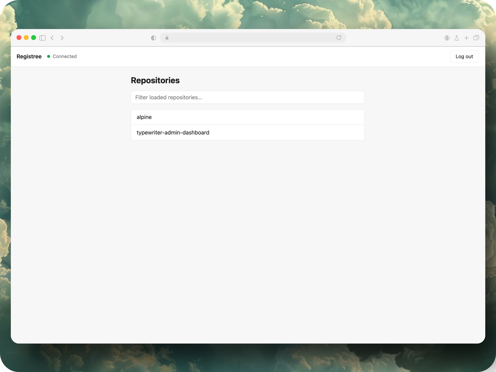

# Registree

A lightweight web UI for browsing and managing a self-hosted Docker Registry v2: repositories, tags, manifest details, and tag deletion.



## Getting started

```bash
pnpm install
pnpm start
```

The app runs at `http://localhost:4200`.

## Running with Docker

Build the image:

```bash
docker build -t registree .
```

Run it, pointing at your Docker Registry v2 API (no trailing slash, no `/v2` suffix):

```bash
docker run -p 8080:80 -e REGISTRY_URL=http://registry:5000 registree
```

Open `http://localhost:8080`. Requests to `/v2/*` are proxied to `REGISTRY_URL` at
container startup, so the same image works against any registry without rebuilding.
